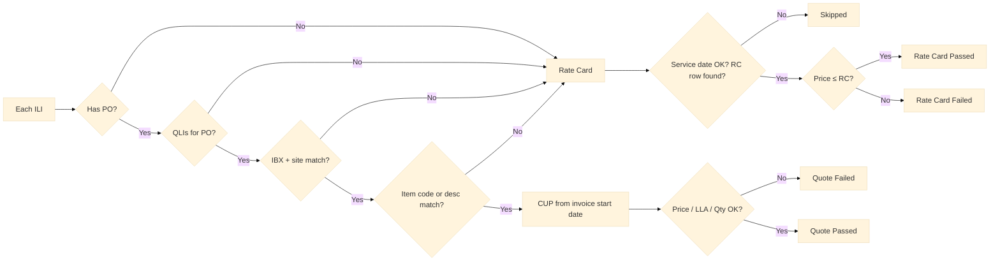
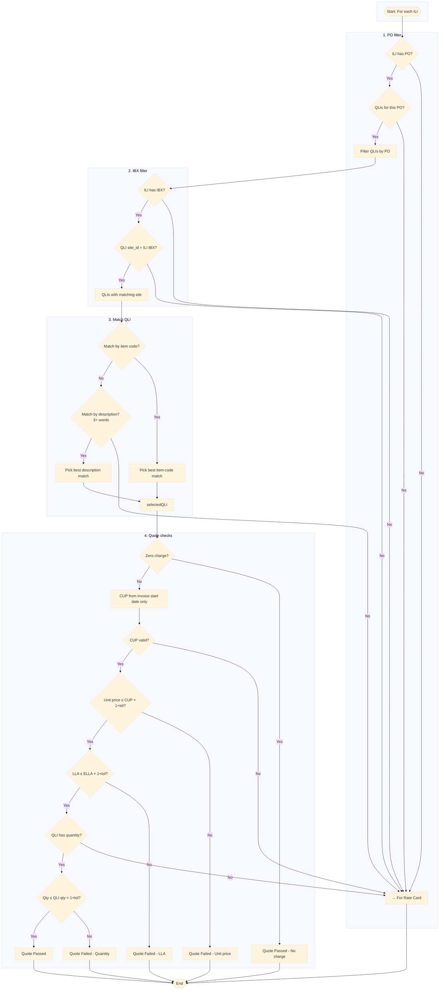
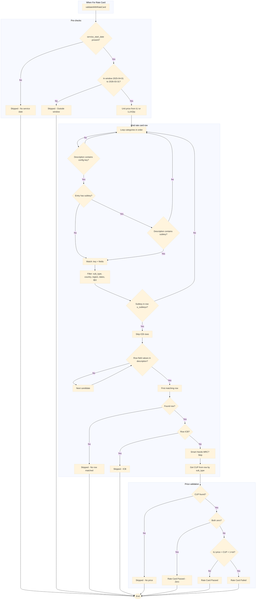
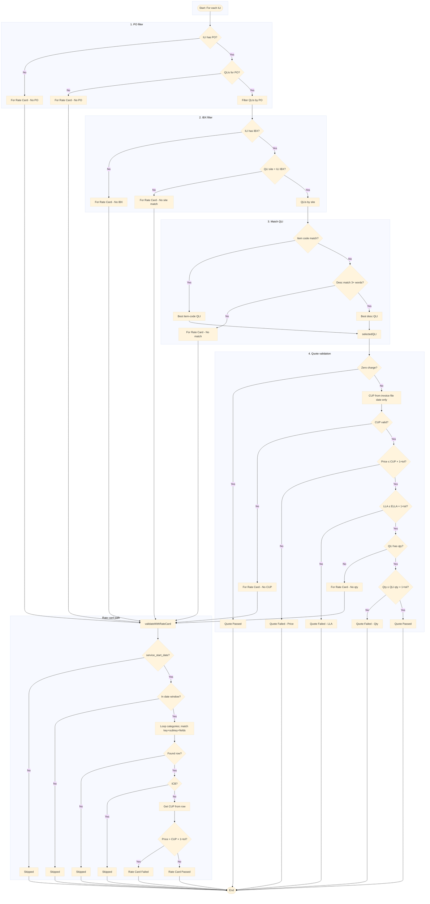
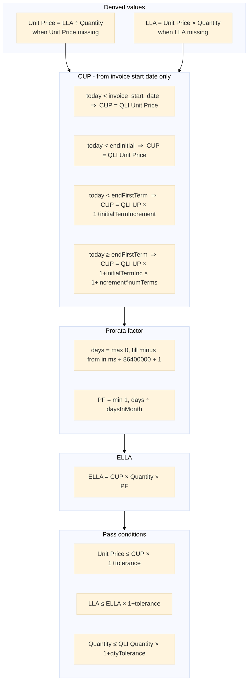

# Invoice vs Quote / Rate Card – Validation Flowcharts

- **Mermaid flowcharts:** Use [mermaid.live](https://mermaid.live/) — paste one diagram at a time for a larger, readable view.
- **Sequence diagram:** Use [SequenceDiagram.org](https://sequencediagram.org/) — paste the code from the section below.

---

## 1. Overview (high-level, large font)

Paste this first for the big picture. Font size is set to 18px for readability.



---

## 2. Quote validation flow (detailed, large font)

Paste this **alone** in Mermaid Live for a clear, readable quote path. Use **View → Zoom in** in the browser if needed.



---

## 3. Rate card validation flow (detailed, large font)

Paste this **alone** in Mermaid Live for a clear, readable rate card path.



---

## 4. Full detail (single diagram, large font)

One combined flowchart with 18px font. Paste in Mermaid Live and use **browser zoom** (Ctrl/Cmd +) if needed.



---

## SequenceDiagram.org – validation flow (paste at [sequencediagram.org](https://sequencediagram.org/))

Copy the block below (no backticks) and paste it into the **source editor** at [SequenceDiagram.org](https://sequencediagram.org/). Use **View → Presentation Mode (Ctrl+M)** and **Zoom** for a readable view. Export via **Export Diagram** (PNG/SVG) or **URL to Share**.

```
title Invoice vs Quote / Rate Card Validation - For each ILI

participant Validator
participant Quote
participant RateCard

Validator->Validator: For each Invoice Line Item
Validator->Quote: Get QLIs by PO number

alt No PO on ILI or no QLIs for PO
  Validator->RateCard: Validate with Rate Card
  note over Validator,RateCard: For Rate Card path
else PO and QLIs exist
  Quote-->>Validator: QLIs
  Validator->Validator: Filter QLIs by IBX / site_id
  alt No IBX on ILI or no QLI with matching site
    Validator->RateCard: Validate with Rate Card
    note over Validator,RateCard: For Rate Card path
  else IBX and site match
    Validator->Validator: Match QLI by item code or description
    alt No item code or description match
      Validator->RateCard: Validate with Rate Card
      note over Validator,RateCard: For Rate Card path
    else QLI matched
      Validator->Validator: CUP from invoice start date only
      Validator->Validator: Check unit price vs CUP, LLA vs ELLA, qty vs quote qty
      alt Unit price or LLA or qty fails
        Validator->Validator: Quote Failed
      else All checks pass
        Validator->Validator: Quote Passed
      end
    end
  end
end

note over Validator,RateCard: Rate card path
Validator->RateCard: validateWithRateCard
activate RateCard
RateCard->RateCard: service_start_date in window?
alt No service date or outside window
  RateCard-->>Validator: Skipped
else In window
  RateCard->RateCard: Loop categories; match key + subkey + fields
  RateCard->RateCard: Filter rows: sub_type, country, region, dates, IBX
  RateCard->RateCard: First row with field values in description
  alt No row found or ICB
    RateCard-->>Validator: Skipped
    deactivate RateCard
  else Row found
    RateCard->RateCard: Get CUP from row
    RateCard-->>Validator: CUP
    deactivate RateCard
    Validator->Validator: ILI price vs CUP × 1+tolerance
    alt ILI price > CUP × 1+tol
      Validator->Validator: Rate Card Failed
    else
      Validator->Validator: Rate Card Passed
    end
  end
end
```

---

## Quote price validation – formulas image

**Option A – HTML (one-page image):**  
Open **`docs/quote-price-validation-formulas.html`** in a browser. Zoom if needed, then **screenshot** or **Print → Save as PDF** to get a single image with all formulas.

**Option B – Mermaid (export as PNG/SVG):**  
Paste the following into [mermaid.live](https://mermaid.live/) and export as image.



---

## CUP calculation (quote path) – detail

Invoice start date is taken **only from the invoice file** (ILI). Used in `getCUP(qli, ili, today)`:

| Condition (using ILI invoice_start_date) | CUP |
|----------------------------------------|-----|
| today &lt; invoice_start_date | QLI unit price |
| today &lt; invoice_start_date + initial_term | QLI unit price |
| today &lt; invoice_start_date + initial_term + term | QLI unit price × (1 + initialTermIncrement) |
| today ≥ invoice_start_date + initial_term + term | QLI unit price × (1 + initialTermIncrement) × (1 + increment)^num_completed_terms |

---

## Rate card category order (first match wins)

1. space_and_power  
2. power_install_nrc  
3. secure_cabinet_express  
4. cabinet_install_nrc  
5. interconnection  
6. smart_hands  
7. equinix_precision_time  

Rate card row is the **first** row that: matches category + sub_type + country + region + dates + IBX, is not ICB, and has every `fields` value present in charge_description.
